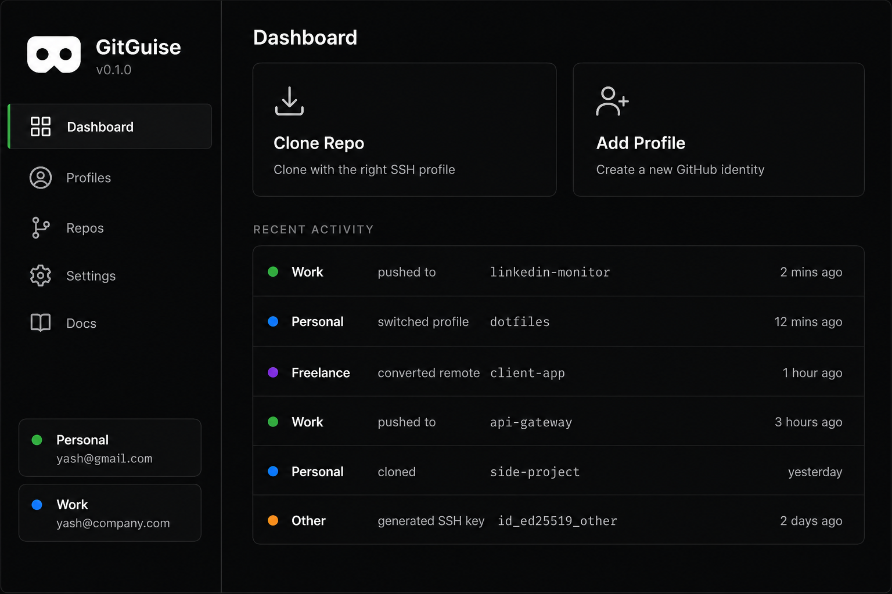

# GitGuise

> One machine. Many identities.

Manage multiple GitHub accounts without the headache.
GitGuise handles SSH keys, config, and hooks automatically.



[](LICENSE)
[]()

## Download

→ [gitguise.dev](https://gitguise.dev) or [GitHub Releases](https://github.com/yash-js/gitguise/releases)

> **Windows note**: GitGuise releases may be **unsigned**. If so, Windows SmartScreen or antivirus tools can show an “Unknown publisher” / warning dialog. This is expected for unsigned installers—download only from official GitHub Releases.

## Features
- Add unlimited profiles (personal, work, freelance)
- Guided 7-step setup wizard
- Auto-detects account from remote URL on push
- Prompts for profile on git init and git remote add
- Repo scanner with per-repo account switcher
- Export/import — new machine in under 2 minutes
- Windows, macOS, Linux

## Development

```bash
cd app
npm install
npm start
```

## Release

Versions are **automatic** via [Conventional Commits](https://www.conventionalcommits.org/) and [release-please](https://github.com/googleapis/release-please).

| Commit prefix | Version bump | Example |
|---|---|---|
| `feat:` | minor (0.1.0 → 0.2.0) | `feat: add profile import` |
| `fix:` | patch (0.1.0 → 0.1.1) | `fix: ssh key detection on Windows` |
| `feat!:` or `BREAKING CHANGE:` | major (0.1.0 → 1.0.0) | `feat!: redesign store schema` |

### How it works

1. Push conventional commits to `main`
2. **Build & Release** runs automatically — builds Windows/macOS/Linux and publishes an `edge` pre-release
3. **release-please** opens a Release PR (version bump + `CHANGELOG.md`)
4. Merge the Release PR → tag `vX.Y.Z` is created → **Build & Release** runs again and attaches assets to the official release
5. **Deploy Landing Page** deploys `web/` to Cloudflare Pages on `main` pushes

Every push to `main` produces downloadable builds under the rolling [`edge` release](https://github.com/yash-js/gitguise/releases/tag/edge). Stable builds land on `vX.Y.Z` tags.

### CI secrets (optional)

| Secret | Used by | How to get it |
|---|---|---|
| `CF_API_TOKEN` | Cloudflare Pages deploy | [Cloudflare dashboard](https://dash.cloudflare.com/profile/api-tokens) → Create Token → Edit Cloudflare Workers template |
| `CF_ACCOUNT_ID` | Cloudflare Pages deploy | Cloudflare dashboard → any zone → right sidebar under **Account ID** |

If these are not set, the landing-page workflow skips deploy with a warning instead of failing.

## Contributing

Use [Conventional Commits](https://www.conventionalcommits.org/) in PR titles and commit messages:

```
feat: add repo filter by label
fix: correct hook path on macOS
docs: update setup instructions
```

Open an issue before starting large changes. PRs welcome for bug fixes and small improvements.

## License
MIT © 2026 Yash Purani
